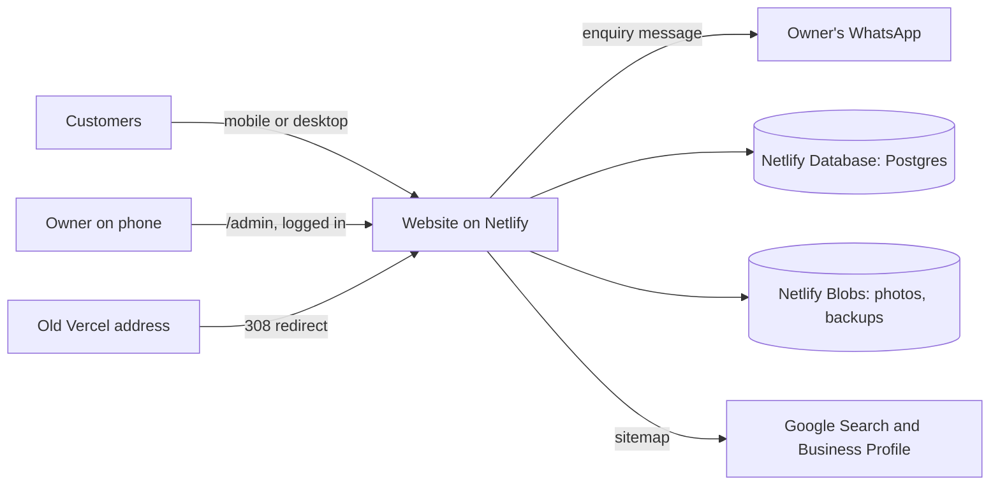
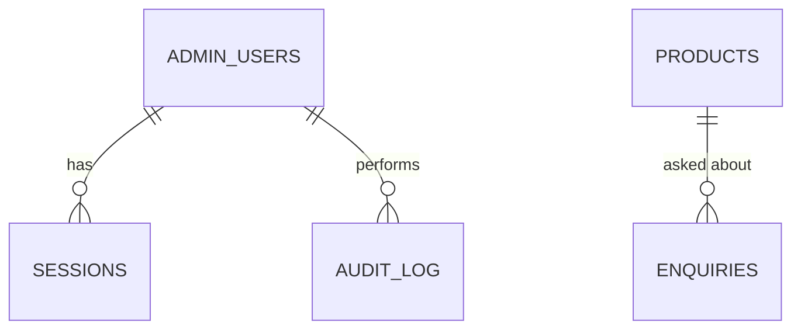
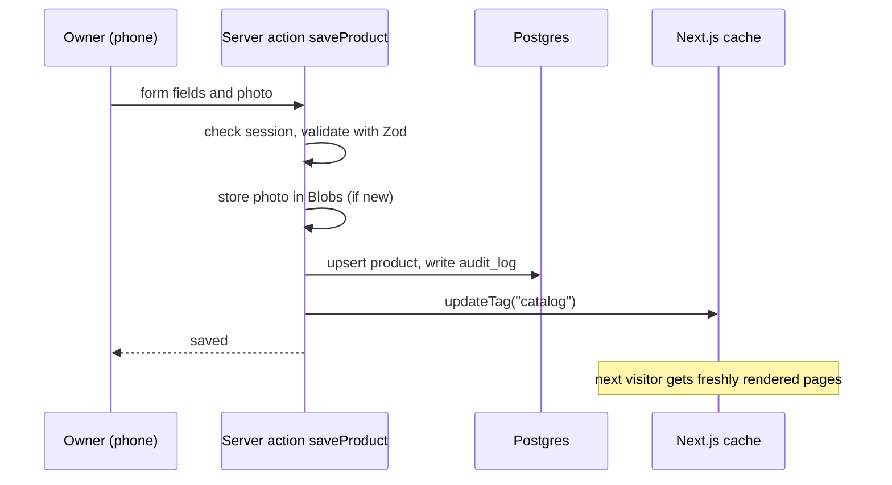

# Architecture and System Design

How the Shree Balaji website is built today, and how Part 2 adds the owner panel, saved enquiries and smart features without giving up speed or free hosting.

Related documents: [Sprint plan](SPRINT-PLAN.md) · [Security](SECURITY.md) · [Scalability](SCALABILITY.md) · [Coding standards](CODING-STANDARDS.md)

---

## 1. Goals and constraints

| Goal | How the design meets it |
|------|-------------------------|
| The owner updates the site without coding | A phone-friendly owner panel at `/admin` writes to a database |
| Changes show quickly | Pages are cached and refreshed on demand when the owner saves, in about a minute, with no redeploy |
| Fast on every phone | Cached pages and images served from a CDN |
| Zero running cost | Netlify free plan (commercial use allowed), with its built-in database and blob storage |
| No enquiry is lost | Enquiries are saved first, then WhatsApp opens as before |
| Customer data stays private | Enquiries are visible only to the logged-in owner, never on public pages or in the API |
| Pages don't care where data comes from | All reads go through `src/services`, so moving from local data to the database changes no page |

**Out of scope:** billing, stock quantities, online payments, staff accounts. See [Scalability](SCALABILITY.md) for the growth path.

---

## 2. System context



---

## 3. Components

### 3.1 Public website (Part 1, live)

- **Next.js 16 (App Router)**, React 19, Tailwind CSS v4. Hosted on Vercel today, moving to **Netlify** in Sprint 1 because Vercel's free plan is for non-commercial use only.
- Clean paths with no query strings. Every page path is built in [`src/lib/routes.ts`](../src/lib/routes.ts):
  - `/products/[slug]` is a category (`/products/paints`) or a product (`/products/ap-royale-luxury`). Category ids and product ids must never overlap.
  - `/products/[slug]/[type]` is a category type (`/products/paints/interior`).
  - `/brands/[slug]` is a brand (`/brands/asian-paints`), and `/enquiry/[productId]` opens the enquiry form with that product chosen.
  - Brands, Offers, About and Contact are their own routes.
- **Data access:** pages and the REST endpoints in `src/app/api/` read through [`src/services/catalog-service.ts`](../src/services/catalog-service.ts). Paths are defined once in [`src/lib/api/endpoints.ts`](../src/lib/api/endpoints.ts).
- **Today:** product data comes from `src/data`, every page is pre-rendered, and enquiries are only a WhatsApp message built in the browser.

### 3.2 What Part 2 adds

| Piece | Technology | Notes |
|-------|-----------|-------|
| Hosting | Netlify (free plan) with its Next.js adapter | Next.js 16 supported with zero configuration, including `use cache` and tag revalidation |
| Database | Netlify Database (managed Postgres) | Products, offers, gallery, enquiries, admin users, sessions, audit log |
| Data access | Drizzle ORM + `pg` | SQL migrations kept in Git |
| Photos and backups | Netlify Blobs | Uploaded photos, plus daily JSON backups |
| Images | `next/image` through Netlify's image CDN | Resized and served as WebP or AVIF |
| Validation | Zod | Every admin action and the enquiry action |
| Caching | `use cache` + `cacheTag` on service reads, `updateTag` after each owner save | Pages stay cached until the owner changes something |
| Scheduled jobs | Netlify scheduled function | Daily backup |

Before building, read the relevant guides in `node_modules/next/dist/docs/` (caching, revalidation, Server Actions, authentication). Next.js 16 has breaking changes; see [AGENTS.md](../AGENTS.md).

---

## 4. Application structure (Part 2 additions)

```text
src/
  app/
    admin/
      login/page.tsx
      (panel)/layout.tsx          # requires a session; owner navigation
      (panel)/page.tsx            # dashboard: new enquiries, quick links
      (panel)/products/...        # list, new, [id] edit
      (panel)/offers/...
      (panel)/gallery/...
      (panel)/enquiries/page.tsx
    gallery/page.tsx
    paint-calculator/page.tsx
    sitemap.ts  robots.ts
  components/
    admin/                        # owner panel forms and lists
    gallery/  calculator/
  lib/
    paint-calculator.ts           # pure: area, litres, pack sizes
  server/
    db/schema.ts  db/client.ts  db/migrations/
    auth/password.ts  auth/session.ts  auth/guard.ts
    actions/                      # Server Actions, one file per resource
    storage/photos.ts             # Netlify Blobs wrapper
    audit.ts
  services/                       # catalog, offers, gallery, enquiries
netlify/functions/daily-backup.mts
```

**Dependency rule:** pages and components → `services` → `server/db`. Client components never import `server/`. `lib/paint-calculator.ts` imports nothing from Next.js or the database.

---

## 5. Data model



| Table | Important columns | Rules |
|-------|-------------------|-------|
| `admin_users` | username, password_hash, failed_attempts, locked_until | One owner account in v1 |
| `sessions` | token_hash, user_id, expires_at | Only a hash of the token is stored |
| `products` | id (slug), name, brand, category, type, description, sizes (jsonb), price_from, unit, image_key, featured, in_stock, is_visible, updated_at | `id` unique and never equal to a category id. `in_stock` is true or false only |
| `offers` | title, body, image_key, starts_on, ends_on | Shown only between the two dates (Asia/Kolkata) |
| `gallery_items` | caption, image_key, sort_order | |
| `enquiries` | name, phone, product_id, quantity, message, source (`form` / `calculator`), status (`NEW` / `CALLED` / `DONE`), created_at | Owner-only. Deleted after 12 months |
| `audit_log` | user_id, action, entity, entity_id, before (jsonb), after (jsonb), at | Append-only |

Categories and their types stay in code (`src/data/category-tree.ts`), because they change rarely and drive the URL structure. Brands are derived from products, as today.

---

## 6. Key flows

### 6.1 Owner saves a product



Product and brand pages render on demand for new ids (`dynamicParams` on), and are cached after the first visit.

### 6.2 Customer sends an enquiry

1. The form is validated in the browser and posted to the `saveEnquiry` action (Zod, honeypot, rate limit).
2. The action stores the enquiry and returns success.
3. The browser opens WhatsApp with the same message as today.
4. If step 1 or 2 fails, the browser still opens WhatsApp, so the owner always receives it.

### 6.3 Paint calculator

`src/lib/paint-calculator.ts` is a pure function:

- `wallArea = 2 × (length + width) × height − doors × doorArea − windows × windowArea (+ ceiling)`, with feet converted to metres.
- `litres = ceil(area × coats ÷ coverage)`, where the coverage per litre comes from the chosen paint type.
- Pack sizes: the combination of the product's sizes that covers the litres with the least waste.

Coverage per litre for each paint type is in `COVERAGE_SQFT_PER_LITRE`. The page is `/paint-calculator`, or `/paint-calculator/[productId]` with that paint chosen (linked from wall-paint product pages). "Send estimate on WhatsApp" asks for confirmation and opens WhatsApp with the room, litres and packs; from Sprint 2 it's also saved as a `calculator` enquiry.

### 6.4 Daily backup

A scheduled function exports all tables (except sessions) to `backups/YYYY-MM-DD.json` in Blobs and keeps the last 30. Uploaded photos are written to a second Blobs store at upload time. Postgres also keeps its own short restore window.

---

## 7. Configuration

| Setting | Where | Notes |
|---------|-------|-------|
| `DATABASE_URL` | Netlify environment (set by Netlify Database) | Never in Git |
| `SESSION_SECRET` | Netlify environment | 32+ random bytes |
| `ADMIN_USERNAME`, `ADMIN_INITIAL_PASSWORD` | Netlify environment | Used once to create the owner; the owner changes the password at handover |
| `SITE_URL` | Netlify environment | Used by the sitemap, metadata and the Vercel redirect |
| Shop name, phone, address, hours | `src/config/shop.ts` | Unchanged |

---

## 8. Architecture decisions (summary)

| # | Decision | Reason | Alternatives rejected |
|---|----------|--------|-----------------------|
| 1 | Netlify free plan | Allows commercial use, supports Next.js 16, includes a database and blob storage | Vercel free (non-commercial only), Vercel Pro (monthly cost), Cloudflare (more adapter work, worker size limits) |
| 2 | Owner panel inside the same Next.js app | One codebase, one deploy, shared components and services | Separate admin app, a hosted CMS |
| 3 | Cached pages refreshed by tag | Fast pages, changes in about a minute, no redeploy (deploys cost free-plan credits) | Rebuild on every change, fully dynamic pages |
| 4 | Postgres with Drizzle | Real constraints and migrations, free, no native binaries | Google Sheets as a CMS (no validation, fragile), JSON committed to Git (no place for enquiries) |
| 5 | Save the enquiry, then open WhatsApp | Nothing lost, and the owner keeps his WhatsApp habit | WhatsApp only (lost chats), form only (slower replies) |
| 6 | Categories stay in code | They define the URL structure and rarely change | Editable categories (risk of broken links) |
