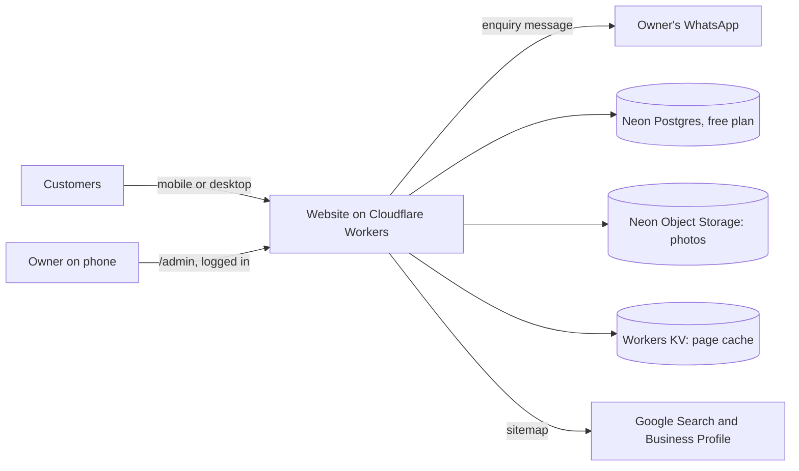
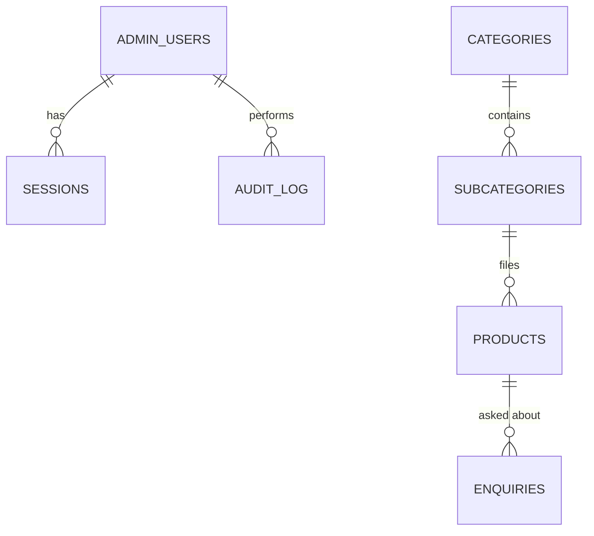
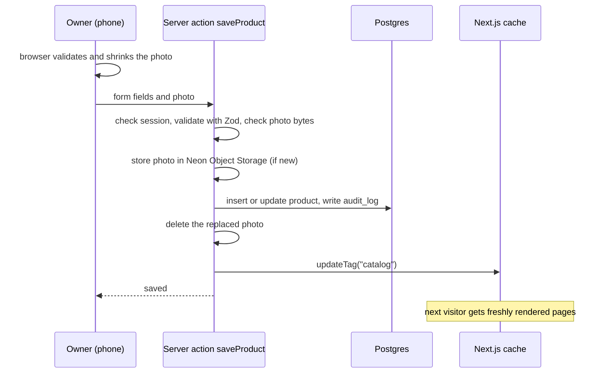

# Architecture and System Design

How the Shree Balaji website is built today, and how Part 2 adds the owner panel, saved enquiries and smart features without giving up speed or free hosting.

Related documents: [Sprint plan](SPRINT-PLAN.md) · [Security](SECURITY.md) · [Scalability](SCALABILITY.md) · [Coding standards](CODING-STANDARDS.md)

---

## 1. Goals and constraints

| Goal | How the design meets it |
|------|-------------------------|
| The owner updates the site without coding | A phone-friendly owner panel at `/admin` writes to a database |
| Changes show quickly | Pages are cached and refreshed on demand when the owner saves, in about a minute, with no redeploy |
| Fast on every phone | Cached pages and images served from a CDN |
| Zero running cost | Cloudflare Workers free plan (commercial use allowed) and Neon's free plan for data and photos (Postgres and Object Storage). No payment card on file anywhere |
| No enquiry is lost | Enquiries are saved first, then WhatsApp opens as before |
| Customer data stays private | Enquiries are visible only to the logged-in owner, never on public pages or in the API |
| Pages don't care where data comes from | All reads go through `src/services`, so moving from local data to the database changes no page |

**Out of scope:** billing, stock quantities, online payments, staff accounts. See [Scalability](SCALABILITY.md) for the growth path.

---

## 2. System context



---

## 3. Components

### 3.1 Public website (Part 1, live)

- **Next.js 16 (App Router)**, React 19, Tailwind CSS v4. Hosted on **Cloudflare Workers** (free plan) through the OpenNext adapter, configured in [`wrangler.jsonc`](../wrangler.jsonc) and [`open-next.config.ts`](../open-next.config.ts). It moved from Vercel (free plan is non-commercial only), then from Netlify (free credits ran out).
- Clean paths with no query strings. Every page path is built in [`src/lib/routes.ts`](../src/lib/routes.ts):
  - `/products/[slug]` is a category (`/products/paints`) or a product (`/products/ap-royale-luxury`). Category ids and product ids must never overlap.
  - `/products/[slug]/[type]` is a category type (`/products/paints/interior-emulsion`).
  - Addresses from the old category list (`/products/plywood/marine`, `/products/hardware`, `/products/plumbing`) redirect permanently to the new ones. The list lives in [`src/lib/legacy-routes.ts`](../src/lib/legacy-routes.ts) and is loaded by `redirects()` in `next.config.ts`.
  - `/brands/[slug]` is a brand (`/brands/asian-paints`), and `/enquiry/[productId]` opens the enquiry form with that product chosen.
  - Brands, Offers, About and Contact are their own routes.
- **Data access:** pages and the REST endpoints in `src/app/api/` read through [`src/services/catalog-service.ts`](../src/services/catalog-service.ts). Paths are defined once in [`src/lib/api/endpoints.ts`](../src/lib/api/endpoints.ts).
- Public pages live in the `src/app/(site)` route group, which adds the navbar, footer and floating buttons. The owner panel under `src/app/admin` has its own frame.
- **Products, categories and their types** come from the database, so the owner panel and the public site always show the same list. `src/data` only seeds an empty database (and is the fallback when the category tables are empty). The popular-brands list still comes from `src/data`.

### 3.2 What Part 2 adds

| Piece | Technology | Notes |
|-------|-----------|-------|
| Hosting | Cloudflare Workers (free plan) with `@opennextjs/cloudflare` | Pages are cached in Workers KV, and cache tags are kept in Durable Objects, which are always checked before a cached page is served, so `updateTag` refreshes pages across the network. The free plan caps the worker at 3 MiB gzipped (checked in CI) |
| Database | Neon Postgres (free plan) | Products, categories, offers, gallery, enquiries, admin users, sessions and audit log |
| Local database | PGlite (Postgres compiled to WebAssembly) | Used when `DATABASE_URL` is not set: saved in `.data/pglite` while developing, in memory for tests and CI. Migrated and seeded with the demo catalogue automatically |
| Data access | Drizzle ORM over Neon's HTTP driver (`@neondatabase/serverless`) | A Worker can't reuse a connection opened by another request, so each query is one HTTP request. SQL migrations in `src/server/db/migrations`, applied with `pg` by `npm run db:migrate` before every Cloudflare build |
| Photos | Neon Object Storage | Uploaded photos in the `product-photos` bucket (declared in `neon.ts`, one per Neon branch), reached over the S3 API with `aws4fetch` because the AWS SDK would not fit the worker size limit. Without the `AWS_*` variables, photos are saved in `.data/photos` |
| Images | `next/image` through Cloudflare Images (the `IMAGES` binding) | The browser shrinks a photo to at most 1600 px before upload; Cloudflare serves WebP or AVIF |
| Validation | Zod | Every admin action and the enquiry action, with the same rules in the browser and on the server |
| Caching | `unstable_cache` with a tag per area (`catalog`, `offers`, `gallery`, ...), `updateTag` after each owner save | Pages stay cached until the owner changes something. The home and offers pages also refresh every hour, so dated offers start and end at midnight on their own |
| Scheduled jobs | Cloudflare cron triggers in `wrangler.jsonc`, handled in `worker.ts` | Calls `/api/health` every 3 minutes to keep Neon awake, and `/api/backup` daily at 2:00 AM India time |

Before building, read the relevant guides in `node_modules/next/dist/docs/` (caching, revalidation, Server Actions, authentication). Next.js 16 has breaking changes; see [AGENTS.md](../AGENTS.md).

---

## 4. Application structure (Part 2 additions)

Built in Sprint 1 unless marked "later".

```text
src/
  app/
    (site)/                       # public pages with the shared navbar and footer
    admin/
      login/page.tsx
      (panel)/layout.tsx          # requires a session; owner navigation
      (panel)/page.tsx            # dashboard: counts and quick links
      (panel)/products/...        # list, new, [id] edit
      (panel)/offers/...          # list, new, [id] edit, [id]/copy
      (panel)/categories/...      # list, new, [id] edit with its types, [id]/types/new, [id]/types/[typeId]
      (panel)/gallery/...
      (panel)/enquiries/page.tsx
    api/photos/[key]/route.ts     # serves uploaded photos
    api/backup/route.ts           # daily backup, called by the cron with a token derived from SESSION_SECRET
    sitemap.ts  robots.ts
  components/
    admin/                        # owner panel forms and lists
  lib/
    product-input.ts              # product form rules shared by browser and server
    offer-input.ts                # offer form rules and the live / starts soon / ended status
    category-input.ts             # category and type form rules (name, position, search title and description)
    category-list.ts              # rows for the owner category and type lists
    legacy-routes.ts              # permanent redirects from the old category addresses
    dates.ts                      # today's date in India
    backup-token.ts               # daily backup cron schedule and token
    photo.ts  resize-photo.ts     # photo type checks; browser-side resizing
    cache-tags.ts
  server/
    db/schema.ts  db/client.ts  db/seed.ts  db/migrations/
    auth/password.ts  auth/session-token.ts  auth/session.ts  auth/guard.ts
    actions/                      # Server Actions: auth, products, categories, offers, gallery, enquiry
    storage/photos.ts             # photos and daily backups in Neon Object Storage, or a local folder
    audit.ts
  services/                       # catalog, admin-product, admin-category, auth, offer, gallery, enquiry, backup
scripts/db-migrate.ts             # applies migrations and the first seed at build time
worker.ts                         # Cloudflare entry: the generated Next.js worker plus the cron handler
```

**Dependency rule:** pages and components → `services` → `server/db`. Client components import nothing from `server/` except Server Actions in `server/actions`. `lib/paint-calculator.ts` imports nothing from Next.js or the database.

---

## 5. Data model



| Table | Important columns | Rules |
|-------|-------------------|-------|
| `admin_users` | username, password_hash, failed_attempts, locked_until | One owner account in v1 |
| `sessions` | token_hash, user_id, expires_at | Only a hash of the token is stored |
| `categories` | id (slug, fixed once created), name, tagline, description, image (optional), seo_title, seo_description, sort_order, is_active | Never deleted from the panel, only hidden. A hidden category hides its types and products from the public site. The id can't equal a product id or an old category address |
| `subcategories` (types) | id (`<category>-<slug>`), category_id, name, description, image, seo_title, seo_description, sort_order, is_active | Name unique within its category. Renaming keeps products linked; the public type address follows the name |
| `products` | id (slug), name, brand, subcategory_id (FK, set null on delete), category and type (names as last saved), description, sizes (jsonb), price_from (whole rupees; empty means "Ask for price"), unit, image, details (jsonb: colours, features, technical data), featured, featured_at, in_stock, is_visible, sort_order, updated_at | `id` unique and never equal to a category id. `in_stock` is true or false only. The public site reads the category and type through `subcategory_id` and shows a product only when it, its type and its category are all visible. A product with no `subcategory_id` is flagged "Needs a category" in the panel. The home page shows the 8 featured products with the latest `featured_at` |
| `offers` | title, body, image (optional), starts_on, ends_on | Shown only from the start of `starts_on` to the end of `ends_on` (Asia/Kolkata). A copied offer shares its photo, which is deleted only when no offer uses it |
| `gallery_items` | caption, image_key, sort_order | |
| `enquiries` | name, phone, product_id, quantity, message, source (`form` / `calculator`), status (`NEW` / `CALLED` / `DONE`), created_at | Owner-only. Deleted after 12 months |
| `audit_log` | user_id, action, entity, entity_id, before (jsonb), after (jsonb), at | Append-only |

Category photos are stored in `categories.image`: a bundled photo under `/images/categories/` or an owner upload under `/api/photos/`. A category without one shows a plain placeholder (`CoverImage`), never a random stock photo. Brands are derived from products, as today.

---

## 6. Key flows

### 6.1 Owner saves a product



Product, brand, enquiry and paint-calculator pages render on demand for new ids (`dynamicParams` on), and are cached after the first visit. A hidden product's page returns 404 once the cache is refreshed.

The stock, home-page and hide switches in the product list call `setProductFlagAction`, which follows the same steps without a photo.

### 6.2 Customer sends an enquiry

1. The form is validated in the browser and posted to the `saveEnquiry` action (Zod, honeypot, rate limit).
2. The action stores the enquiry and returns success.
3. The browser opens WhatsApp with the same message as today.
4. If step 1 or 2 fails, the browser still opens WhatsApp, so the owner always receives it.

### 6.3 Paint calculator

`src/lib/paint-calculator.ts` is a pure function:

- `wallArea = 2 × (length + width) × height − doors × doorArea − windows × windowArea (+ ceiling)`, with feet converted to metres.
- `litres = ceil(area × coats ÷ coverage)`, where the coverage per litre comes from the chosen paint type.
- Pack sizes: the combination of the product's sizes that covers the litres with the least waste.

Coverage per litre for each paint type is in `COVERAGE_SQFT_PER_LITRE`. The page is `/paint-calculator`, or `/paint-calculator/[productId]` with that paint chosen (linked from wall-paint product pages). "Send estimate on WhatsApp" asks for confirmation and opens WhatsApp with the room, litres and packs; from Sprint 2 it's also saved as a `calculator` enquiry.

### 6.4 Daily backup

Neon's automatic snapshots aren't available on the free plan, so the app makes its own. At 20:30 UTC (2:00 AM in India) a cron trigger in `worker.ts` posts to `/api/backup` with an HMAC token derived from `SESSION_SECRET`. The route writes categories, subcategories, products, offers, gallery and enquiries to `backups/YYYY-MM-DD.json` in the private `product-photos` bucket and deletes the file from 30 days earlier. Admin users, sessions and the audit log are left out. The photo route only serves keys shaped like photo keys, so backups can't be downloaded through it. Postgres also keeps its own short restore window.

---

## 7. Configuration

| Setting | Where | Notes |
|---------|-------|-------|
| `DATABASE_URL` | Cloudflare build variable and runtime secret: Neon's pooled connection string | Never in Git. Cloudflare builds fail without it. Leave it unset locally to use PGlite |
| `AWS_ACCESS_KEY_ID`, `AWS_SECRET_ACCESS_KEY`, `AWS_ENDPOINT_URL_S3`, `AWS_REGION` | Cloudflare runtime secrets: the production branch's Object Storage credentials | Locally, `neon env pull` writes the dev branch's values into `.env.local` |
| `SESSION_SECRET` | Cloudflare runtime secret | 32+ random characters. Production refuses to start sessions without it |
| `ADMIN_USERNAME`, `ADMIN_INITIAL_PASSWORD` | Cloudflare runtime secrets | Used once to create the owner; the owner changes the password at handover |
| `SITE_URL` | Cloudflare build and runtime variable | Used by the sitemap, `robots.txt` and metadata. Defaults to the `workers.dev` address |
| Shop name, phone, address, hours | `src/config/shop.ts` | Unchanged |

---

## 8. Architecture decisions (summary)

| # | Decision | Reason | Alternatives rejected |
|---|----------|--------|-----------------------|
| 1 | Cloudflare Workers free plan | Allows commercial use, supports Next.js 16 through OpenNext, no monthly build credits and no payment card needed | Vercel free (non-commercial only), Netlify free (credits ran out), paid plans (monthly cost) |
| 2 | Owner panel inside the same Next.js app | One codebase, one deploy, shared components and services | Separate admin app, a hosted CMS |
| 3 | Cached pages refreshed by tag | Fast pages, changes in about a minute, no redeploy (deploys cost free-plan credits) | Rebuild on every change, fully dynamic pages |
| 4 | Postgres with Drizzle | Real constraints and migrations, free, no native binaries | Google Sheets as a CMS (no validation, fragile), JSON committed to Git (no place for enquiries) |
| 5 | Save the enquiry, then open WhatsApp | Nothing lost, and the owner keeps his WhatsApp habit | WhatsApp only (lost chats), form only (slower replies) |
| 6 | Categories and types live in the database, products link by subcategory id | One list for the panel and the site; renaming a type can't orphan its products. Category ids never change and old addresses redirect | Categories in code (owner can't change them), linking products by type name (a rename breaks the link) |
| 7 | Neon's free Postgres plan | Plain Postgres that works with any host | A host-specific database (ties the data to the host) |
| 8 | `unstable_cache` with tags, not Cache Components | Works with the current pages unchanged and is shared across Cloudflare locations through the KV cache and Durable Object tags | `cacheComponents` (needs Suspense around the navbar, bans `dynamicParams`, keeps `use cache` in one instance's memory) |
| 9 | PGlite when no `DATABASE_URL` | Developers, tests and CI run real Postgres SQL with no setup | A shared cloud database for development (slow, easy to damage), SQLite (different SQL) |
